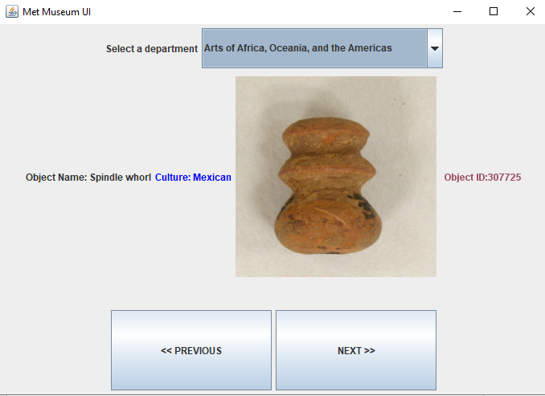
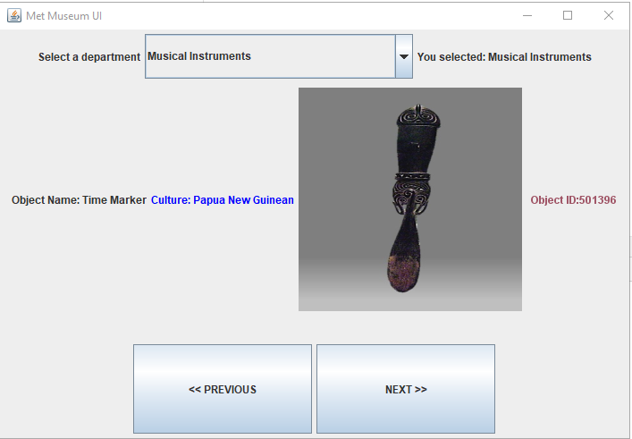
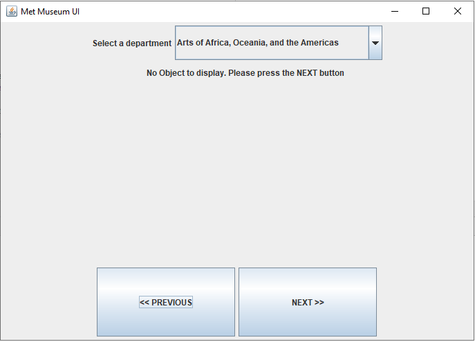

# Met Museum API Display

This is a project I completed for MCO-152 to demonstrate

* APIs
* JSON
* Retrofit
* Gson
* Gradle
* Mockito
* Model-View-Controller pattern
* Factory pattern
* Executable Jar Files
* Markdown

Download Executable [jar File](https://github.com/shiraalter/met-museum/blob/master/build/libs/metmuseum-1.0-SNAPSHOT.jar)

This displays data from the [Met Museum](https://collectionapi.metmuseum.org/) 

